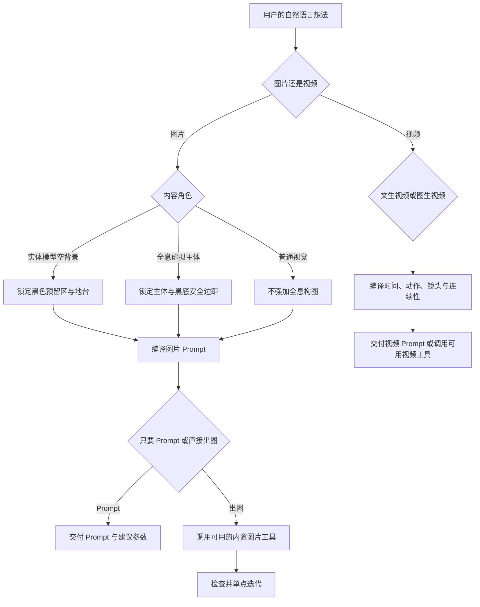

# Imagecreation Agent

一个面向新用户的 Codex 图片与视频 Prompt 创作插件。它把模糊想法整理成可执行的生成规格，重点支持全息展示柜、实体模型展示背景、黑底全息主体、参考图分析、图片修改、批量变体以及图生视频/循环视频 Prompt。

插件的图片场景规则来自团队真实创作记录的提炼。仓库不包含原始聊天记录、训练文档、客户素材、API Key 或第三方中转地址。

## 核心问题

全息展示创作中最容易混淆的是两种不同任务：

- **实体模型展示背景**：画面本身不包含主体，需要为真实模型或后期合成保留纯黑区域和空地台。
- **全息虚拟主体**：画面本身包含要展示的角色、产品或物体，通常要求黑底、主体完整和清晰轮廓。

本插件会先区分这两类任务，再决定是否加入纯黑预留区、低地台、边缘布景或主体安全边距，避免用错 Prompt 模板。

## 功能

- 用最多三个关键问题引导新用户完成创作需求
- 输出供应商中立的图片或视频 Prompt
- 在环境具备内置图片生成能力时直接生成或编辑图片
- 分析参考图的构图、负空间、视角、明暗、材质和细节密度
- 为实体模型背景锁定纯黑预留区、低地台和边缘布景
- 将“太黑”“太脏”“地台太高”“细节太多”等反馈转换为可执行修改
- 每轮只修改一个主要问题，并重复未变化约束以减少漂移
- 为同风格批量作品设计变化矩阵，而不是完全随机生成
- 编写文生视频、图生视频和无缝循环展示视频 Prompt
- 防止 API Key、令牌和第三方凭据进入 Skill 或生成 Prompt

## 工作流



## 仓库结构

```text
Imagecreation_Agent/
├── .agents/
│   └── plugins/
│       └── marketplace.json
├── plugins/
│   └── hologram-image-creator/
│       ├── .codex-plugin/
│       │   └── plugin.json
│       └── skills/
│           └── hologram-image-creator/
│               ├── SKILL.md
│               ├── agents/
│               │   └── openai.yaml
│               └── references/
│                   ├── team-scene-patterns.md
│                   └── video-prompting.md
├── .gitignore
└── README.md
```

## 安装为 Codex 插件

前提：本机已安装支持插件命令的 Codex CLI。

1. 克隆仓库：

```bash
git clone https://github.com/colo-yolo/Imagecreation_Agent.git
cd Imagecreation_Agent
```

2. 添加仓库 Marketplace：

```bash
codex plugin marketplace add .
```

3. 安装插件：

```bash
codex plugin add hologram-image-creator@imagecreation-agent
```

4. 确认状态：

```bash
codex plugin list
```

应看到 `hologram-image-creator@imagecreation-agent` 处于 `installed, enabled` 状态。安装或更新后请新开一个 Codex 会话，使新的 Skill 被加载。

## 只安装 Skill

不需要 Marketplace 时，可以只复制 Skill 文件夹。

PowerShell：

```powershell
$codexHome = if ($env:CODEX_HOME) { $env:CODEX_HOME } else { Join-Path $HOME '.codex' }
$source = '.\plugins\hologram-image-creator\skills\hologram-image-creator'
$target = Join-Path $codexHome 'skills\hologram-image-creator'
Copy-Item -Recurse -Force $source $target
```

macOS/Linux：

```bash
CODEX_HOME="${CODEX_HOME:-$HOME/.codex}"
cp -R ./plugins/hologram-image-creator/skills/hologram-image-creator \
  "$CODEX_HOME/skills/hologram-image-creator"
```

复制后新开会话，并使用 `$hologram-image-creator` 调用。

## 快速使用

### 1. 引导新用户制作实体模型背景

```text
使用 $hologram-image-creator，我是新手，想给实体模型制作一个花园水面展示背景，请帮我完成 Prompt。
```

默认会采用团队案例中稳定的展示背景契约：

- 16:9 横版
- 正面平视、中心轴或左右平衡构图
- 明确纯黑预留区的形状和位置
- 低矮空地台位于画面下方约五分之一到四分之一
- 植物、建筑或机械结构停留在边缘
- 黑区保持纯黑，但前景和地台保持明亮清晰

这些是默认值，不是强制参数。用户提供设备画幅、地台高度或黑区形状时，以用户要求为准。

### 2. 只生成图片 Prompt

```text
使用 $hologram-image-creator，只帮我写 Prompt，不要出图。做一张白色未来机库背景，中间是矩形纯黑门洞，下方保留低圆台。
```

### 3. 直接生成图片

```text
使用 $hologram-image-creator，生成一张明亮的东方月洞花园展示背景，中间留纯黑，先做一张预览。
```

插件优先使用当前环境已有的内置图片生成能力，不要求为内置能力提供 API Key。若工具不可用，它只交付最终 Prompt，并明确说明没有生成图片。

### 4. 修改已有图片

```text
使用 $hologram-image-creator 修改这张图：只把地台降低，其他构图、黑色预留区、花园风格和灯光保持不变。
```

编辑本地图片时，Skill 会先查看图片，再把请求拆成：

```text
仅修改：本轮唯一改动
必须保持：构图、视角、预留区、地台以外区域、材质和灯光
避免：主体漂移、额外物体、黑区污染和新增伪影
```

### 5. 批量生成同风格变体

```text
使用 $hologram-image-creator，为同一展示柜设计 10 张花园背景。保持黑区、地台、视角和明亮风格不变，让建筑轮廓、花种和天气各不相同。
```

Skill 会先锁定共同不变量，再为每张图选择两到三个变化轴，并为每个资产编写独立 Prompt。

### 6. 图生循环视频 Prompt

```text
使用 $hologram-image-creator，把这张展示背景扩展成 6 秒无缝循环的图生视频 Prompt。镜头固定，只让水面和少量光粒缓慢运动。
```

视频 Prompt 会包含：起始画面、主体动作、环境运动、镜头、时间推进、结束状态、灯光连续性、不变量和避免项。

## 图片场景规则

团队案例覆盖了花园水面舞台、机库与维护舱、自然地台、东方圆门、极端环境舞台和黑底单体素材。详细规则见：

- [`team-scene-patterns.md`](plugins/hologram-image-creator/skills/hologram-image-creator/references/team-scene-patterns.md)

常见反馈会被转换为明确约束：

| 用户反馈 | Prompt 修正方向 |
| --- | --- |
| 太黑、太脏 | 只保留预留区纯黑，提高前景曝光，减少灰雾和脏色 |
| 地台太高 | 地台表面降低到画面下方约五分之一，增加上方负空间 |
| 中间不干净 | 重复黑区形状和禁入项，将光、雾、粒子和装饰移到边缘 |
| 细节太多 | 限制道具种类与数量，保留清晰的前景、地台和边缘三层 |
| 镜头太高或太斜 | 锁定正面平视、水平光轴、无俯视和无斜视 |
| 不够宏伟 | 增加空间尺度和远近参照，不用堆积零件制造规模感 |

## 视频能力边界

上传的团队素材主要是图片创作记录，没有完整的视频生成评测。因此视频模块使用供应商中立的保守规则，不宣称已经过团队视频案例验证。

详细规则见：

- [`video-prompting.md`](plugins/hologram-image-creator/skills/hologram-image-creator/references/video-prompting.md)

对于展示柜循环视频，默认建议一个主要动作、最多两个环境动作、稳定或极慢镜头，并保护黑色预留区不被粒子、光束、雾气或反射穿越。

## 任务模式

| 模式 | 行为 |
| --- | --- |
| `prompt-only` | 只交付图片 Prompt，不调用生成工具 |
| `image-generate` | 编译 Prompt，并在工具可用时生成图片 |
| `image-edit` | 查看目标图片，执行单点修改并保护不变量 |
| `video-prompt` | 交付文生视频或图生视频 Prompt |
| `video-generate` | 仅在环境明确提供视频工具时执行，否则退回 Prompt |

## 安全与隐私

- 不要把 API Key、访问令牌或第三方中转凭据写入对话模板、Skill 或仓库。
- 使用外部 API 时，把密钥放在本机环境变量或可信的密钥管理服务中。
- 插件不会自动使用历史记录中的模型、API 地址或认证方式。
- 插件不辅助仿制真实个人的签名、字迹或审批意见；可以改为无身份指向的通用手写风格或虚构练习文本。
- 本仓库不包含内部训练案例和嵌入图片。如需公开案例，请先完成授权、脱敏和密钥轮换。

## 验证

仓库中的 Skill 和 Plugin 可以使用 Codex 自带的创建器脚本验证。

PowerShell：

```powershell
$codexHome = if ($env:CODEX_HOME) { $env:CODEX_HOME } else { Join-Path $HOME '.codex' }
$plugin = '.\plugins\hologram-image-creator'

$env:PYTHONUTF8 = '1'
py -3.12 "$codexHome\skills\.system\skill-creator\scripts\quick_validate.py" `
  "$plugin\skills\hologram-image-creator"
py -3.12 "$codexHome\skills\.system\plugin-creator\scripts\validate_plugin.py" `
  $plugin
```

成功时应看到：

```text
Skill is valid!
Plugin validation passed: ...
```

## 本地开发与更新

修改 `SKILL.md` 或参考文件后：

1. 重新运行 Skill 和 Plugin 验证。
2. 使用 `update_plugin_cachebuster.py` 更新本地插件版本后缀。
3. 重新执行 `codex plugin add hologram-image-creator@imagecreation-agent`。
4. 新开 Codex 会话进行真实请求测试。

不要为了触发更新不断增加主版本号；本地开发使用 Codex cachebuster 后缀即可。

## 设计原则

- 新用户无需掌握 Prompt 工程术语。
- 信息足够时直接执行，不增加无意义确认。
- 一轮只修改一个主要问题。
- 生成变体时锁定共同契约，只改变有限维度。
- 工具不可用时如实交付 Prompt，不声称已经生成资产。
- 供应商未指定时保持 Prompt 中立，不编造模型参数。

## License

本仓库目前未附带开源许可证。公开可见不代表自动授予复制、修改或再分发权；如需开放协作，请由仓库所有者选择并添加明确许可证。
